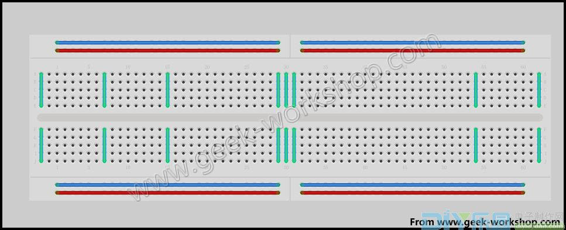
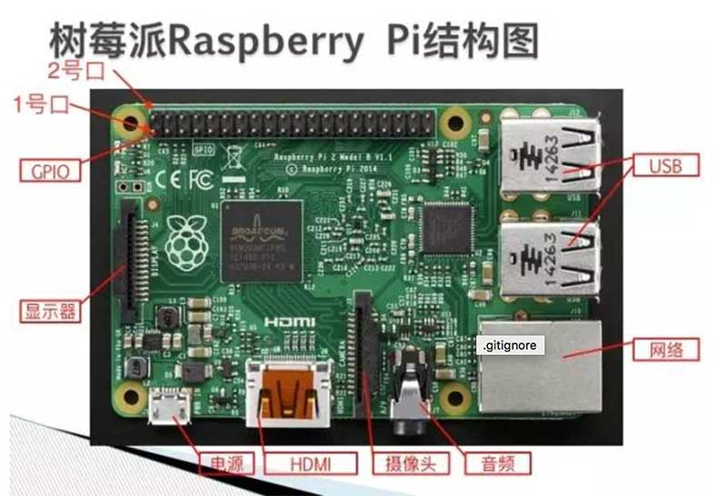
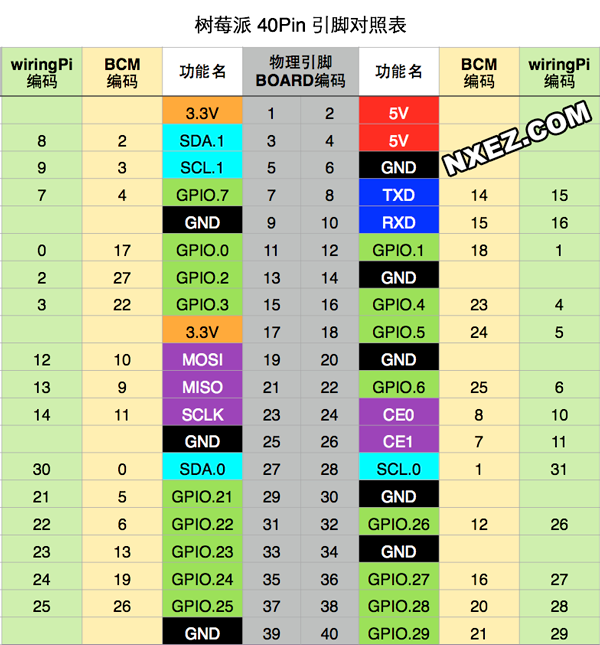
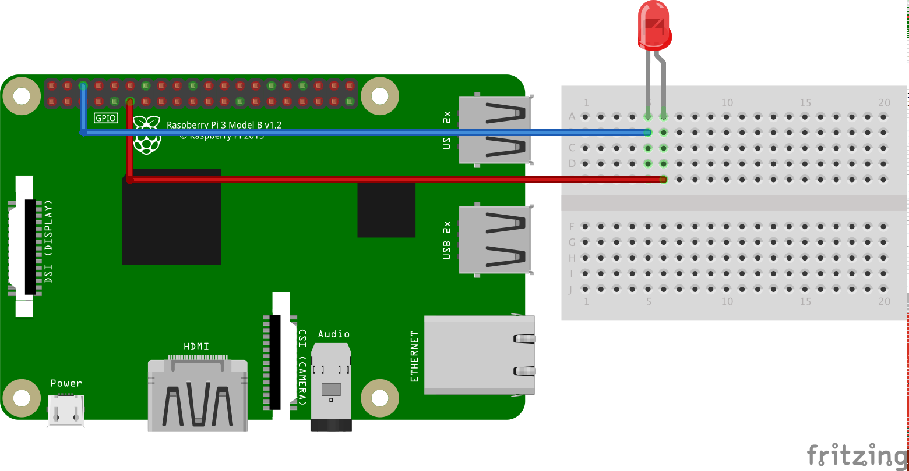
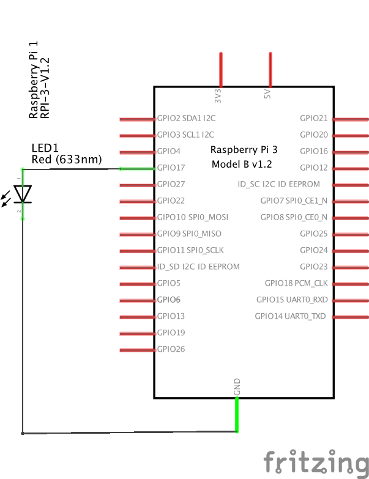
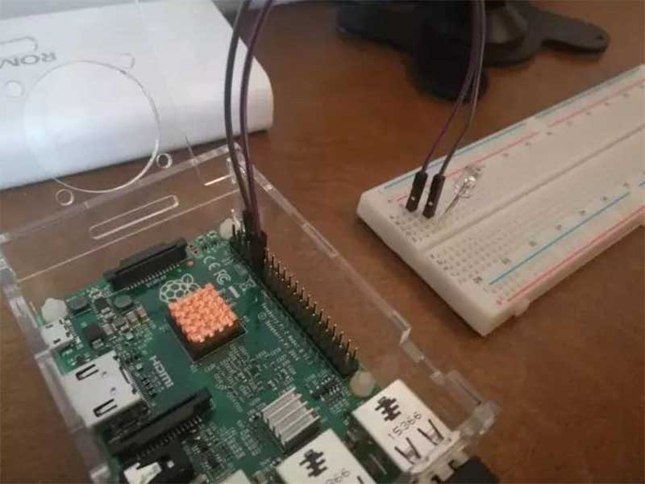

# 点亮LED

## 概述
本教程目的是用程序将 LED 灯点亮，3秒钟后灯自动熄灭。在所有软件编程语言中，第一个程序都叫 `hello world`，而今天的点灯教程其实就是硬件编程的 hello world，例子非常简单。

通过本节课，我们能学习到：
* 硬件编程初体验
* 面包板的使用
* LED 原理
* 通过 `GPIO` 来控制硬件

## 所需硬件
* 树莓派 x1
* 面包板 x1
* 杜邦线 x2
* LED灯 x1

## 名称解释
下面对本实验中要涉及到的一些电子元件和专业名称做简单介绍：

### 面包板


面包板是专为电子电路的无焊接实验设计制造的，板子上有很多小插孔，由于各种电子元器件可根据需要随意插入或拔出，免去了焊接，节省了电路的组装时间，而且元件可以重复使用，所以非常适合电子电路的组装、调试和训练。

由于最上一行和最下一行往往都是相通的，所以这两行往往用于连接电路的电源线和地线，而元器件之间的连接往往采用中的各列。中间部分每五列栅格为一组，这一组五个栅格是导通的，在最中间的位置有一条凹槽，用于隔断左右两部分。

### LED 灯
LED 是英文 Light Emitting Diode（发光二极管）的缩写。它有2个脚，长脚是正极，短脚是负极。当有电流流过时，LED 就会亮起。

### GPIO
GPIO（General Purpose I/O Ports）意思为通用输入/输出端口，通俗地说，就是一些引脚，可以通过它们输出高低电平或者通过它们读入引脚的状态-是高电平或是低电平。GPIO是个比较重要的概念，用户可以通过GPIO口和硬件进行数据交互(如UART)，控制硬件工作(如LED、蜂鸣器等),读取硬件的工作状态信号（如中断信号）等。GPIO口的使用非常广泛，掌握了GPIO，差不多相当于掌握了操作硬件的能力。

现在，我们先看看树莓派上的GPIO是怎么样的，这是树莓派的正面图：


上面有40根排针，这就是树莓派用于控制外部传感器的接口，称之为 `GPIO`。40根引脚如何进行编号呢？如果按照物理位置来编号，只要掌握一个规则就容易记住：
最靠近角上的那一根引脚为2号引脚。旁边的就是1号引脚，具体请看上图示意图。

那么这40根引脚具体的用途和定义是什么呢，请看下面的图：



这个图是一个比较全面的一个定义，主要是因为对于这40根引脚有不同的编号规则来定义
虽然不同的规则叫的名字不一样，但实际的用途是一致的
这里只学习一种编号规则，也就是物理位置编号，这样更容易进行物理连接。

比如：1号引脚，是输出1个3.3伏的电压，也就是如果用数字万用表去测量这根引脚的电压，会一直测出来是3.3伏。

比如：2号引脚，是输出1个5伏的电压，也就是如果用数字万用表去测量这根引脚的电压，会一直测出来是5伏。

比如：6号引脚，是一个`GND`，也就是接地，如果测量电压的话，就是0伏。

比如：11号引脚，是绿色图标，旁边写着`GPIO17`，其实这个接口就是普通的接口，可以输入也可以输出。如果设置为输出，则可以输出高电压或者低电压。输出高电压就是3.3伏，输出低电压就是0伏。可以通过程序来控制。GPIO17是另外一种编号方式而已，这里我们可以忽略。

假如需要一个恒定的电压输出到某个电路，则可以选择3.3v或者5v的相应接口。

假如需要一个变化的电压输出到某个电路，则可以选择绿色的GPIO接口，例如11号、12号、13号、15号等。

### python GPIO
该库更确切的名称为`raspberry-gpio-python`，树莓派官方资料中推荐且容易上手。python GPIO是一个小型的python库，可以帮助用户完成raspberry相关IO口操作。但是python GPIO库还没有支持SPI、I2C或者1-wire等总线接口。除了python GPIO之外，还有众多的python扩展库（例如webiopi），毫无疑问的说python非常适合树莓派，树莓派也非常适合python。

## 连线图
在开始连接硬件电路之前，首先要做的事是将树莓派电脑关机，并断开电源。因为如果树莓派主板带电的时候，进行插接电路可能会导致电子元器件的烧毁，所以一定要记住：
> 连接电路的时候主板必须断电。


*图片使用 [Fritzing](http://www.fritzing.org/) 绘制，更多示例图片请到 [Fritzing官网](http://fritzing.org/projects/) 浏览。*

## 电路原理图


## 示例代码
连好线后，接下来的工作就是写代码。想用 python 来控制 GPIO，最便捷的办法就是使用一些 python 类库，比如树莓派系统本身集成的 `RPi.GPIO`。

本文详细介绍如何使用`RPi.GPIO`来控制 GPIO，当然，你可以用任何喜欢的语言来控制 GPIO。

### 导入RPi.GPIO模块
可以用下面的代码导入`RPi.GPIO`模块。

```python
import RPi.GPIO as GPIO
```

引入之后，就可以使用 GPIO 模块的函数了。如果你想检查模块是否引入成功，也可以这样写：

```python
try:
    import RPi.GPIO as GPIO
except RuntimeError:
    print("引入错误")
```

### 针脚编号
在 RPi.GPIO 中，同时支持树莓派上的两种 GPIO 引脚编号。

第一种编号是`BOARD编号`，这和树莓派电路板上的物理引脚编号相对应。使用这种编号的好处是，你的硬件将是一直可以使用的，不用担心树莓派的版本问题。因此，在电路板升级后，你不需要重写连接器或代码。

第二种编号是`BCM规则`，是更底层的工作方式，它和Broadcom的片上系统中信道编号相对应。在使用一个引脚时，你需要查找信道号和物理引脚编号之间的对应规则。对于不同的树莓派版本，编写的脚本文件也可能是无法通用的。

你可以使用下列代码（强制的）指定一种编号规则：

```python
GPIO.setmode(GPIO.BOARD)
  # or
GPIO.setmode(GPIO.BCM)
```

下面代码将返回被设置的编号规则

```python
mode = GPIO.getmode()
```

### 警告
如果`RPi.GRIO`检测到一个引脚已经被设置成了非默认值，那么你将看到一个警告信息。你可以通过下列代码禁用警告：

```python
GPIO.setwarnings(False)
```

### 引脚设置
在使用一个引脚前，你需要设置这些引脚作为输入还是输出。配置一个引脚的代码如下：

```python
# 将引脚设置为输入模式
GPIO.setup(channel, GPIO.IN)

# 将引脚设置为输出模式
GPIO.setup(channel, GPIO.OUT)

# 为输出的引脚设置默认值
GPIO.setup(channel, GPIO.OUT, initial=GPIO.HIGH)
```

### 释放
一般来说，程序到达最后都需要释放资源，这个好习惯可以避免偶然损坏树莓派。释放脚本中使用的引脚：

```python
GPIO.cleanup()
```

注意，GPIO.cleanup()只会释放掉脚本中使用的GPIO引脚，并会清除设置的引脚编号规则。

### 输出
要想点亮一个 LED 灯或者驱动某个设备，都需要给它们电流和电压，这个步骤也很简单，设置引脚的输出状态就可以了，代码如下：

```python
GPIO.output(channel, state)
```

状态可以设置为0 / GPIO.LOW / False / 1 / GPIO.HIGH / True。如果编码规则为，GPIO.BOARD，那么channel就是对应引脚的数字。

如果想一次性设置多个引脚，可使用下面的代码：

```python
chan_list = [11,12]
GPIO.output(chan_list, GPIO.LOW)
GPIO.output(chan_list, (GPIO.HIGH, GPIO.LOW))
```

你还可以使用Input()函数读取一个输出引脚的状态并将其作为输出值，例如：

```python
GPIO.output(12, not GPIO.input(12))
```

### 读取
我们也常常需要读取引脚的输入状态，获取引脚输入状态如下代码：

```python
GPIO.input(channel)
```

低电平返回`0 / GPIO.LOW / False`，高电平返回`1 / GPIO.HIGH / True`。

如果输入引脚处于悬空状态，引脚的值将是漂动的。换句话说，读取到的值是未知的，因为它并没有被连接到任何的信号上，直到按下一个按钮或开关。由于干扰的影响，输入的值可能会反复的变化。
使用如下代码可以解决问题：

```python
GPIO.setup(channel, GPIO.IN, pull_up_down=GPIO.PUD_UP)
  # or
GPIO.setup(channel, GPIO.IN, pull_up_down=GPIO.PUD_DOWN)
```

需要注意的是，上面的读取代码只是获取当前一瞬间的引脚输入信号。

如果需要实时监控引脚的状态变化，可以有两种办法。最简单原始的方式是每隔一段时间检查输入的信号值，这种方式被称为轮询。如果你的程序读取的时机错误，则很可能会丢失输入信号。轮询是在循环中执行的，这种方式比较占用处理器资源。另一种响应GPIO输入的方式是使用中断（边缘检测），这里的边缘是指信号从高到低的变换（下降沿）或从低到高的变换（上升沿）。

### 轮询方式
```python
while GPIO.input(channel) == GPIO.LOW:
    time.sleep(0.01)  # wait 10 ms to give CPU chance to do other things
```

### 边缘检测

边缘是指信号状态的改变，从低到高（上升沿）或从高到低（下降沿）。通常情况下，我们更关心于输入状态的该边而不是输入信号的值。这种状态的该边被称为事件。
先介绍两个函数：

* wait_for_edge() 函数
wait_for_edge()被用于阻止程序的继续执行，直到检测到一个边沿。也就是说，上文中等待按钮按下的实例可以改写为：

```python
channel = GPIO.wait_for_edge(channel, GPIO_RISING, timeout=5000)
if channel is None:
  print('Timeout occurred')
else:
  print('Edge detected on channel', channel)
```

* add_event_detect() 函数
该函数对一个引脚进行监听，一旦引脚输入状态发生了改变，调用event_detected()函数会返回true，如下代码：

```python
GPIO.add_event_detect(channel, GPIO.RISING)  # add rising edge detection on a channel
do_something()
# 下面的代码放在一个线程循环执行。
if GPIO.event_detected(channel):
  print('Button pressed')
```

上面的代码需要自己新建一个线程去循环检测event_detected()的值，还算是比较麻烦的。

不过可采用另一种办法轻松检测状态，这种方式是直接传入一个回调函数：

```python
def my_callback(channel):
    print('This is a edge event callback function!')
    print('Edge detected on channel %s'%channel)
    print('This is run in a different thread to your main program')

GPIO.add_event_detect(channel, GPIO.RISING, callback=my_callback)
```

如果你想设置多个回调函数，可以这样：

```python
def my_callback_one(channel):
    print('Callback one')

def my_callback_two(channel):
    print('Callback two')

GPIO.add_event_detect(channel, GPIO.RISING)
GPIO.add_event_callback(channel, my_callback_one)
GPIO.add_event_callback(channel, my_callback_two)
```

注意：回调触发时，并不会同时执行回调函数，而是根据设置的顺序调用它们。

好了，上面说明了一大堆函数库的用法，那么现在就应该来个简单的实验了

```python
#!/usr/bin/env python
# encoding: utf-8

# 导入模块RPI.GPIO，命名为别名为GPIO
import RPi.GPIO as GPIO
# 导入time模块
import time

# 声明 GPIO 使用物理编号方式，也就是11号口就是物理编号11号口
GPIO.setmode(GPIO.BOARD)

# 声明11号口是用于输出模式
GPIO.setup(11, GPIO.OUT)

# 设置11号口为高电压，也就是11号口变为3.3伏
# 这行代码执行之后，11号口变为高电压，
# 那么根据电路原理，led灯就会亮起来
GPIO.output(11, GPIO.HIGH)

# 程序休眠3秒钟，程序休眠期间，led灯会一直亮着
time.sleep(3)

# 设置11号口为低电压，也就是11号口变为0伏，和GND一样
# 这行代码执行之后，11号口变为低电压，那么根据电路原理，led灯就会熄灭
GPIO.output(11, GPIO.LOW)

# 将所有的GPIO口状态恢复为初始化，一般代码结束都执行此代码，这是一个好习惯
GPIO.cleanup()
```

保存文件为`led.py`，并运行之，看看 LED 灯是否亮3秒后熄灭。
```
sudo python led.py
```

## 最终效果


## 相关课程目录
1. [准备工作](../01prepare)
1. [点亮LED](../02blink)
1. [呼吸灯](../03fading-led)
1. [用单位数码管显示数字倒计时](../04digital-1)
1. [用双位数码管显示CPU温度](../05digital-2)
1. 控制蜂鸣器发声
1. 用温湿度探头检测室内温度
1. 用光敏传感器检测光线强度
1. 超声波测距
1. 红外遥控器
1. 声控灯
1. 进步电机
1. 用液晶显示器显示文字
1. 继电器
1. 让摄像头工作
