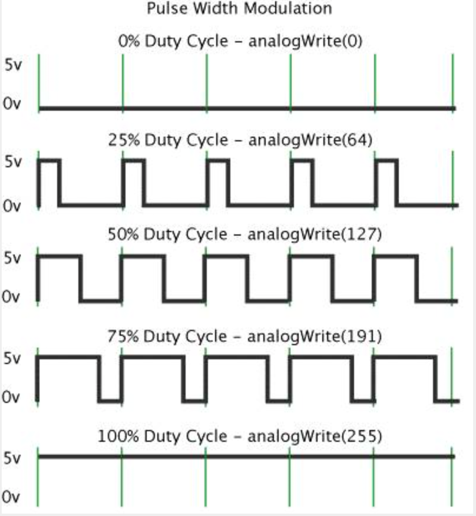
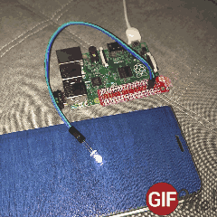

# 呼吸灯

## 概述
[上一篇](../02blink) 我们通过控制`GPIO`口输出高低电平来控制一只 LED 的亮灭。这次我们来控制 LED 的亮度，灯由暗渐渐变亮，再由亮渐渐边暗，反复循环，也就是呼吸灯的效果。按 `ctrl` + `c` 中断程序。

通过本节课，你能学习到：
* 脉冲宽度调制技术

## 所需硬件
* 树莓派 x1
* 面包板 x1
* 杜邦线 x2
* LED灯 x1

## 名称解释
我们知道，通过LED的电流越大，LED越亮，电流越小，LED越暗。如果可以控制输出电流大小就可以控制LED的明暗了。但是树莓派的各引脚并没有直接调整输出电流大小的功能，要想别的办法。这里，我们需要了解以下2个名词：

### 脉宽调制（PWM）
脉冲宽度调制（PWM）是一种利用数字手段获得模拟结果的技术。数字控制用于创建方波，电平在高和低之间切换。简单的说，`PWM`技术就是不停的通断电路并控制通断持续的时间片段长度，从而控制用电器在单位时间内实际得到的电能。再简单点说，如果你的手足够快，打开电灯开关后马上关闭，如果这个时间间隔足够短，灯丝还没有全部亮起来就暗下去了。你再次打开电灯再关闭，再打开再关闭……如果你一直保持相同的频率，那么电灯应该会保持一个固定的亮度不变。理论上，你可以通过调整开灯持续的时间长度和关灯持续的时间长度的比例就能得到不同亮度了。

“导通时间”的持续时间称为脉冲宽度。要获得不同的模拟值，可以更改该脉冲的宽度。

### 占空比
一个脉冲循环内通电时间所占的比例。



## 连线图
在开始连接硬件电路之前，首先要做的事是将树莓派电脑关机，并断开电源。因为如果树莓派主板带电的时候，进行插接电路可能会导致电子元器件的烧毁，所以一定要记住：
> 连接电路的时候主板必须断电。

本次的接线图和[上一篇](../02blink)的连线图完全一样


*图片使用 [Fritzing](http://www.fritzing.org/) 绘制，更多示例图片请到 [Fritzing官网](http://fritzing.org/projects/) 浏览。*

## 电路原理图


## 示例代码
```python
#!/usr/bin/env python
# encoding: utf-8

import RPi.GPIO as GPIO
import time

# 定义引脚编号
channel = 11

GPIO.setmode(GPIO.BOARD)
GPIO.setup(channel, GPIO.OUT)

# 创建一个 PWM 实例，需要两个参数，第一个是GPIO端口号，这里我们用11号
# 第二个是频率（Hz），频率越高LED看上去越不会闪烁，相应对CPU要求就越高，设置合适的值就可以
pwm = GPIO.PWM(channel, 80)

# 启用 PWM，参数是占空比，范围：0.0 <= 占空比 >= 100.0
pwm.start(0)

try:
  while True:
    # 电流从小到大，LED由暗到亮
    for i in xrange(0, 101, 2):
      pwm.ChangeDutyCycle(i)
      time.sleep(0.02)

    # 再让电流从大到小，LED由亮变暗
    for i in xrange(100, -1, -2):
      pwm.ChangeDutyCycle(i)
      time.sleep(0.02)

# 最后一段是一个小技巧。这个程序如果不强制停止会不停地执行下去。
# 而Ctrl+C强制终端程序的话，GPIO口又没有机会清理。
# 加上一个try except 可以捕捉到Ctrl+C强制中断的动作，
# 试图强制中断时，程序不会马上停止而是会先跳到这里来做一些你想做完的事情，比如清理GPIO口。
except KeyboardInterrupt:
  pass

# 停用 PWM
pwm.stop()

# 清理GPIO口
GPIO.cleanup()
```

保存文件为`breathing-light.py`，并运行之。
```
sudo python breathing-light.py
```

## 最终效果


## 相关课程目录
1. [准备工作](01prepare)
1. [点亮LED](02blink)
1. [呼吸灯](03fading-led)
1. [用单位数码管显示数字倒计时](04digital-1)
1. [用双位数码管显示CPU温度](05digital-2)
1. 控制蜂鸣器发声
1. 用温湿度探头检测室内温度
1. 用光敏传感器检测光线强度
1. 超声波测距
1. 红外遥控器
1. 声控灯
1. 进步电机
1. 用液晶显示器显示文字
1. 继电器
1. 让摄像头工作
