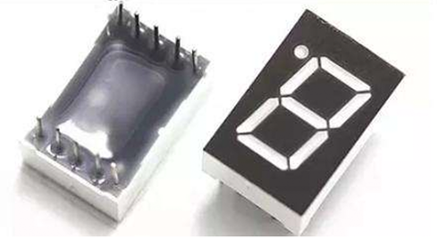
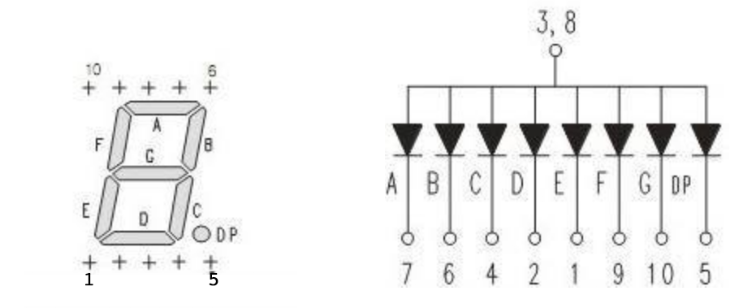
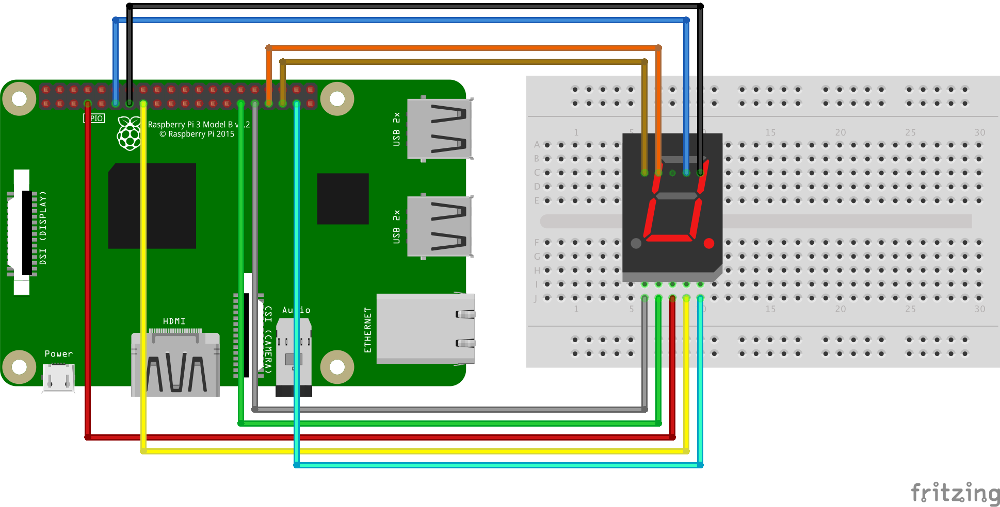
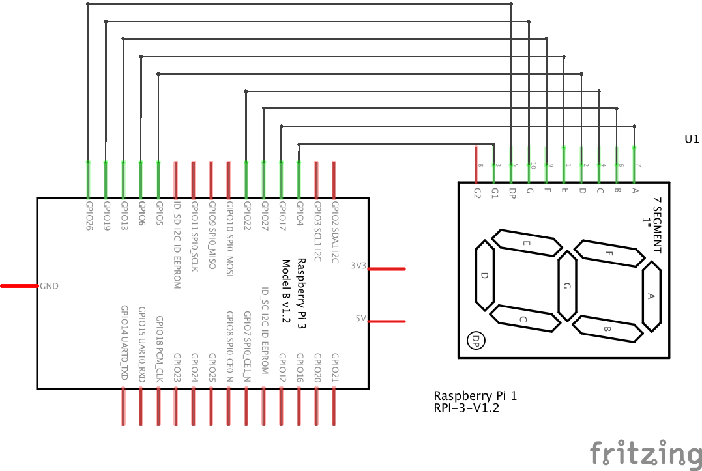
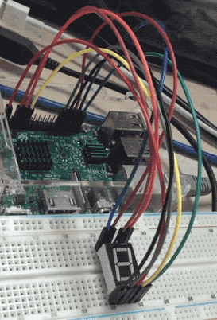

# 用1位数码管显示数字倒计时

## 概述



[上一篇](../03fading-led) 我们学习了使用 PWM 来控制 LED 的亮度，这次我们学习使用1位数码管显示个位数字倒计时。

通过本节课，我们能学习到：
* 1位数码管的显示原理

## 所需硬件
* 树莓派 x1
* 面包板 x1
* 杜邦线 x9
* 1位数码管 x1

## 名称解释

### 数码管
数码管也称 LED 数码管，不同行业人士对数码管的称呼不一样，其实都是同样的产品。

数码管按段数可分为七段数码管和八段数码管，八段数码管比七段数码管多一个发光二极管单元，也就是多一个小数点（DP）这个小数点可以更精确的表示数码管想要显示的内容；按能显示多少个（8）可分为1位、2位、3位、4位、5位、6位、7位等数码管。

按发光二极管单元连接方式可分为共阳极数码管和共阴极数码管。共阳数码管是指将所有发光二极管的阳极接到一起形成公共阳极(COM)的数码管，共阳数码管在应用时应将公共极COM接到+5V，当某一字段发光二极管的阴极为低电平时，相应字段就点亮，当某一字段的阴极为高电平时，相应字段就不亮。共阴数码管是指将所有发光二极管的阴极接到一起形成公共阴极(COM)的数码管，共阴数码管在应用时应将公共极COM接到地线GND上，当某一字段发光二极管的阳极为高电平时，相应字段就点亮，当某一字段的阳极为低电平时，相应字段就不亮。

### 1位共阳数码管电路图
我们今天使用的是 5161BS 型号的1位共阳数码管，先看看它的电路原理图：



左图是数码管的每个管子的定义，从最上面的 A 管依次到中间的 G 管，还有小数点的 DP 管。通过组合 A 管到 G 管的不同亮起来和熄灭，就可以显示出数字信息。比如，让ABCDG这5根管亮起来，就能显示数字3了。

左图还包含关于引脚的编号，从正面看过去，让小数点放在右下角，下面从左到右为1到5号引脚
，上面从右向左是6到10号引脚，这10个引脚的编号很重要，因为需要了解每个引脚的功能定义，才能决定如何通过引脚输入电压信号。

右图是电路原理图，上面一层是3号引脚或者8号引脚，这是公共正极，中间一层是 A 管到 DP 管，也就是数码管的8个管子，下面一层是10个引脚剩余的8个引脚。当中的 A 管到 DP 管，大家可以当作每个管都是一个 LED 灯一样的，有正极和负极，正极输入高电压，负极输入 GND，就可以让数码管的单个管子亮起来。比如3号引脚输入高电压，7号引脚输入低电压 GND，A 管的2端产生电压差，就可以让 A 管亮起来；但是如果7号引脚如果也输入高电压，A 管的2端没有电压差，A 管就会熄灭。

## 连线图
在开始连接硬件电路之前，首先要做的事是将树莓派电脑关机，并断开电源。因为如果树莓派主板带电的时候，进行插接电路可能会导致电子元器件的烧毁，所以一定要记住：
> 连接电路的时候主板必须断电。


*图片使用 [Fritzing](http://www.fritzing.org/) 绘制，更多示例图片请到 [Fritzing官网](http://fritzing.org/projects/) 浏览。*

## 电路原理图


## 示例代码
```python
#!/usr/bin/env python
# encoding: utf-8

'''
该程序实现 9 --> 0 倒计时效果
接线图：
RPi    digital
7  <---> 3
11 <---> 7
13 <---> 6
15 <---> 4
29 <---> 2
31 <---> 1
33 <---> 9
35 <---> 10
37 <---> 5
'''

import RPi.GPIO as GPIO
import time

# 正极使用的针脚
LED_POWER = 7
# A－G管分别使用的针脚
LED_A = 11
LED_B = 13
LED_C = 15
LED_D = 29
LED_E = 31
LED_F = 33
LED_G = 35
LED_DP = 37

# 重置数码管，熄灭所有数字
def reset():
  GPIO.output(LED_POWER, GPIO.LOW)
  GPIO.output((LED_A, LED_B, LED_C, LED_D, LED_E, LED_F, LED_G, LED_DP), GPIO.HIGH)

# 显示数字0
def show0():
  reset()
  GPIO.output(LED_POWER, GPIO.HIGH)
  GPIO.output((LED_A, LED_B, LED_C, LED_D, LED_E, LED_F), GPIO.LOW)

# 显示数字1
def show1():
  reset()
  GPIO.output(LED_POWER, GPIO.HIGH)
  GPIO.output((LED_B, LED_C), GPIO.LOW)

# 显示数字2
def show2():
  reset()
  GPIO.output(LED_POWER, GPIO.HIGH)
  GPIO.output((LED_A, LED_B, LED_D, LED_E, LED_G), GPIO.LOW)

# 显示数字3
def show3():
  reset()
  GPIO.output(LED_POWER, GPIO.HIGH)
  GPIO.output((LED_A, LED_B, LED_C, LED_D, LED_G), GPIO.LOW)

# 显示数字4
def show4():
  reset()
  GPIO.output(LED_POWER, GPIO.HIGH)
  GPIO.output((LED_B, LED_C, LED_F, LED_G), GPIO.LOW)

# 显示数字5
def show5():
  reset()
  GPIO.output(LED_POWER, GPIO.HIGH)
  GPIO.output((LED_A, LED_C, LED_D, LED_F, LED_G), GPIO.LOW)

# 显示数字6
def show6():
  reset()
  GPIO.output(LED_POWER, GPIO.HIGH)
  GPIO.output((LED_A, LED_C, LED_D, LED_E, LED_F, LED_G), GPIO.LOW)

# 显示数字7
def show7():
  reset()
  GPIO.output(LED_POWER, GPIO.HIGH)
  GPIO.output((LED_A, LED_B, LED_C), GPIO.LOW)

# 显示数字8
def show8():
  reset()
  GPIO.output(LED_POWER, GPIO.HIGH)
  GPIO.output((LED_A, LED_B, LED_C, LED_D, LED_E, LED_F, LED_G), GPIO.LOW)

# 显示数字9
def show9():
  reset()
  GPIO.output(LED_POWER, GPIO.HIGH)
  GPIO.output((LED_A, LED_B, LED_C, LED_D, LED_F, LED_G), GPIO.LOW)

GPIO.setmode(GPIO.BOARD)

# 初始化引脚输出模式
GPIO.setup((LED_POWER, LED_A, LED_B, LED_C, LED_D, LED_E, LED_F, LED_G, LED_DP), GPIO.OUT)

# 倒计时程序
function_directory = locals()
for i in range(0, 10)[::-1]:
  function_directory['show%s'%(i)]()
  time.sleep(1)

GPIO.cleanup()
```

保存文件为`digital-1.py`，并运行之。
```
sudo python digital-1.py
```

## 最终效果

