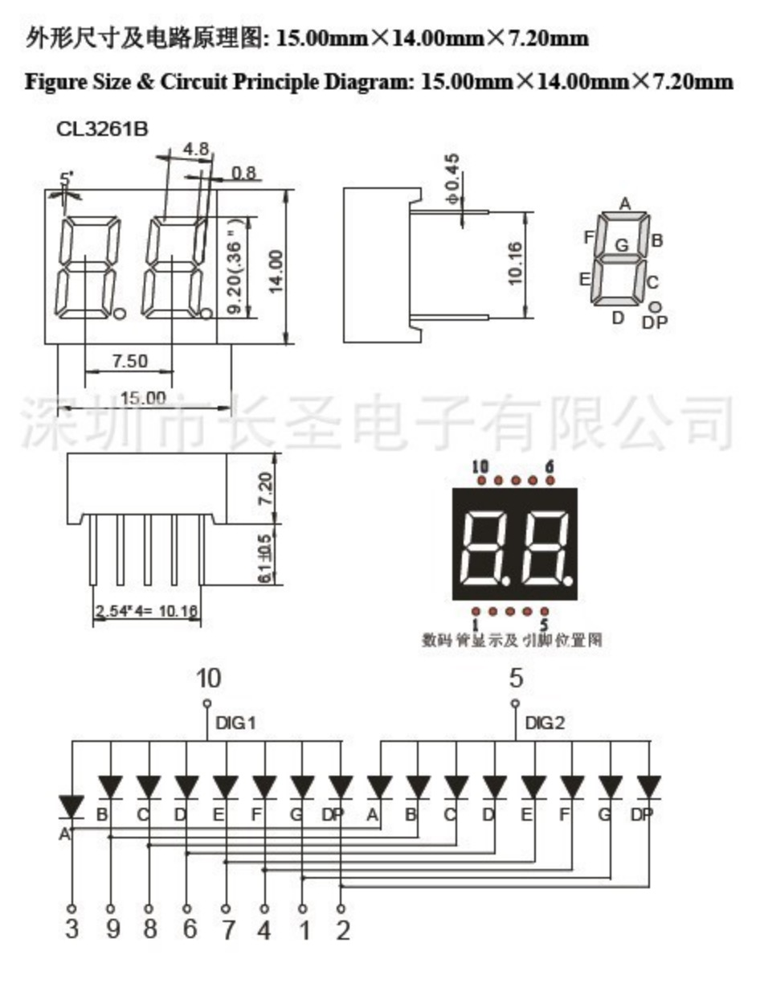
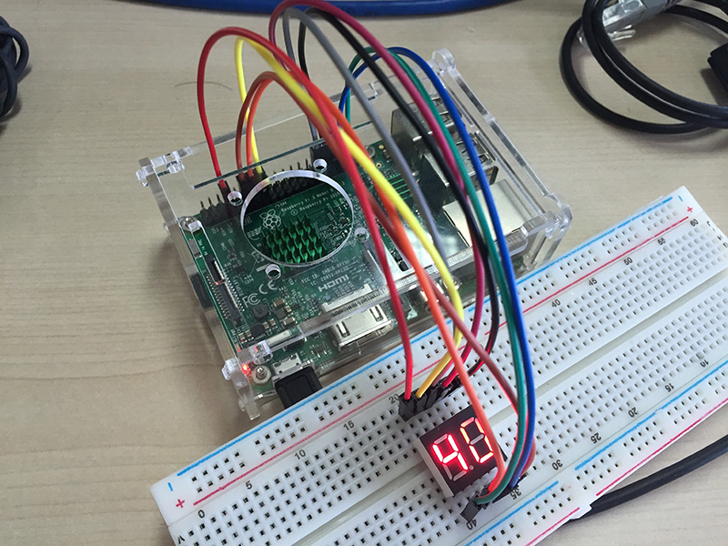

# 用2位数码管显示CPU温度

## 概述


[上一篇](../04digital-1) 我们学习使用1位数码管显示个位数字倒计时，这次我们学习使用2位数码管显示CPU的温度。

通过本节课，我们能学习到：
* 2位数码管的显示原理
* 视觉暂留显示技巧

## 所需硬件
* 树莓派 x1
* 面包板 x1
* 杜邦线 x9
* 2位数码管 x1

## 原理说明
我们今天使用的是 3261BS 型号的2位共阳数码管，先看看它的电路原理图：



通过 [上一篇](../04digital-1) 的学习，我们能够看懂1位数码管的电路图了，而2位数码管可以简单的理解为2个1位数码管的组合。

我们看最下面的一张图，10号引脚和5号引脚，分别是数码管第一个数字和第二个数字的公共阳极。

**目标一：让数码管1和数码管2的 A 管分别亮起来**

数码管|期望达到的效果|需要做的电路控制
---|---|---
数码管1|A 管亮|10号引脚高电压，3号引脚低电压
数码管2|A 管亮|5 号引脚高电压，3号引脚低电压

这个和操作1位数码管是一样的，但再看看接下来的目标可能就比较麻烦了：

**目标二：让数码管1的 A 管亮，同时让数码管2的 A 管不亮**

数码管|期望达到的效果|需要做的电路控制
---|---|---
数码管1|A 管亮|10号引脚高电压，*3号引脚低电压*
数码管2|A 管不亮|5号引脚高电压，*3号引脚高电压*

问题出来了：因为3号引脚是共用的，所以这种电路控制无法实现。那怎么解决这个问题呢？为了解决这个问题，这里我们需要借助 `视觉暂留`

### 视觉暂留
这个原理最早源于电影制作。科学实验证明，人眼在某个视像消失后，仍可使该物像在视网膜上滞留0.1－0.4秒左右。电影胶片以每秒24格画面匀速转动，一系列静态画面就会因视觉暂留作用而造成一种连续的视觉印象，产生逼真的动感。家里常用的日光灯也是这个原理，日光灯并非一直亮着的，而是在以很快的频率进行亮灭亮灭，当闪烁的频率达到每秒25次以上的时候，人眼就认为是一直亮着的。

可以利用这个原理，只要在足够短的时间间隔里分别显示2个数码管的数字，在人的视觉上就会认为这2个数字是同时显示的。那我们在电路控制采用的办法就是对3号引脚进行分时分配：0.01秒用于数码管1的 A 管，接下来的0.01秒用于数码管2的 A 管，这样1秒钟之内可以刷新50次，确保数码管没有闪烁感。

## 连线图
在开始连接硬件电路之前，首先要做的事是将树莓派电脑关机，并断开电源。因为如果树莓派主板带电的时候，进行插接电路可能会导致电子元器件的烧毁，所以一定要记住：
> 连接电路的时候主板必须断电。


*图片使用 [Fritzing](http://www.fritzing.org/) 绘制，更多示例图片请到 [Fritzing官网](http://fritzing.org/projects/) 浏览。*

## 电路原理图


## 示例代码
```python
#!/usr/bin/env python
# encoding: utf-8

'''
接线图：
RPi    digital
7  <---> 10
11 <---> 5
13 <---> 3
15 <---> 9
29 <---> 8
31 <---> 6
33 <---> 7
35 <---> 4
37 <---> 1

'''

import RPi.GPIO as GPIO
import time
import os


# 数码管1-2正极分别使用的针脚
LED_POWER_1 = 7
LED_POWER_2 = 11

# A－G管分别使用的针脚
LED_A = 13
LED_B = 15
LED_C = 29
LED_D = 31
LED_E = 33
LED_F = 35
LED_G = 37

# 获取CPU温度
def get_cpu_temperature():
  return os.popen('vcgencmd measure_temp').read()[5:7]

# 重置数码管，熄灭所有数字
def reset():
  GPIO.output((LED_POWER_1, LED_POWER_2), GPIO.LOW)
  GPIO.output((LED_A, LED_B, LED_C, LED_D, LED_E, LED_F, LED_G), GPIO.HIGH)

# 设置第几个数码管亮起
def set_position(position):
  if position == 1:
    GPIO.output(LED_POWER_1, GPIO.HIGH)
  else:
    GPIO.output(LED_POWER_2, GPIO.HIGH)

# 显示数字0
def show0(p):
  reset()
  set_position(p)
  GPIO.output((LED_A, LED_B, LED_C, LED_D, LED_E, LED_F), GPIO.LOW)

# 显示数字1
def show1(p):
  reset()
  set_position(p)
  GPIO.output((LED_B, LED_C), GPIO.LOW)

# 显示数字2
def show2(p):
  reset()
  set_position(p)
  GPIO.output((LED_A, LED_B, LED_D, LED_E, LED_G), GPIO.LOW)

# 显示数字3
def show3(p):
  reset()
  set_position(p)
  GPIO.output((LED_A, LED_B, LED_C, LED_D, LED_G), GPIO.LOW)

# 显示数字4
def show4(p):
  reset()
  set_position(p)
  GPIO.output((LED_B, LED_C, LED_F, LED_G), GPIO.LOW)

# 显示数字5
def show5(p):
  reset()
  set_position(p)
  GPIO.output((LED_A, LED_C, LED_D, LED_F, LED_G), GPIO.LOW)

# 显示数字6
def show6(p):
  reset()
  set_position(p)
  GPIO.output((LED_A, LED_C, LED_D, LED_E, LED_F, LED_G), GPIO.LOW)

# 显示数字7
def show7(p):
  reset()
  set_position(p)
  GPIO.output((LED_A, LED_B, LED_C), GPIO.LOW)

# 显示数字8
def show8(p):
  reset()
  set_position(p)
  GPIO.output((LED_A, LED_B, LED_C, LED_D, LED_E, LED_F, LED_G), GPIO.LOW)

# 显示数字9
def show9(p):
  reset()
  set_position(p)
  GPIO.output((LED_A, LED_B, LED_C, LED_D, LED_F, LED_G), GPIO.LOW)

GPIO.setmode(GPIO.BOARD)

# 初始化引脚输出模式
GPIO.setup((LED_POWER_1, LED_POWER_2, LED_A, LED_B, LED_C, LED_D, LED_E, LED_F, LED_G), GPIO.OUT)

function_directory = locals()

try:
  while True:
    cpu_temperature = get_cpu_temperature()
    print 'CPU temperature = %s°C'%(cpu_temperature)

    loop = 0
    while loop < 200:
      loop += 1
      # 先显示高位
      position = 1
      for n in cpu_temperature:
        function_directory['show%s'%(n)](position)
        time.sleep(0.01)
        position += 1

except KeyboardInterrupt:
  GPIO.cleanup()
```

保存文件为`digital-2.py`，并运行之。
```
sudo python digital-2.py
```

## 最终效果


## 总结
我们使用视觉暂留的显示方式来驱动2位数码管显示数字，其它多位（如4位，8位）数码管的显示也和2位数码管的显示方式类似。

## 相关课程目录
1. [准备工作](../01prepare)
1. [点亮LED](../02blink)
1. [呼吸灯](../03fading-led)
1. [用单位数码管显示数字倒计时](../04digital-1)
1. [用双位数码管显示CPU温度](../05digital-2)
1. 控制蜂鸣器发声
1. 用温湿度探头检测室内温度
1. 用光敏传感器检测光线强度
1. 超声波测距
1. 红外遥控器
1. 声控灯
1. 进步电机
1. 用液晶显示器显示文字
1. 继电器
1. 让摄像头工作
